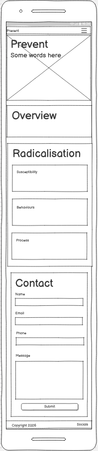
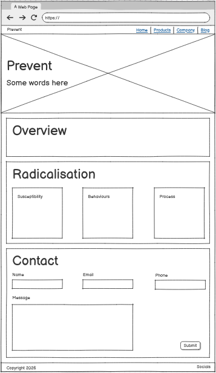
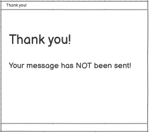
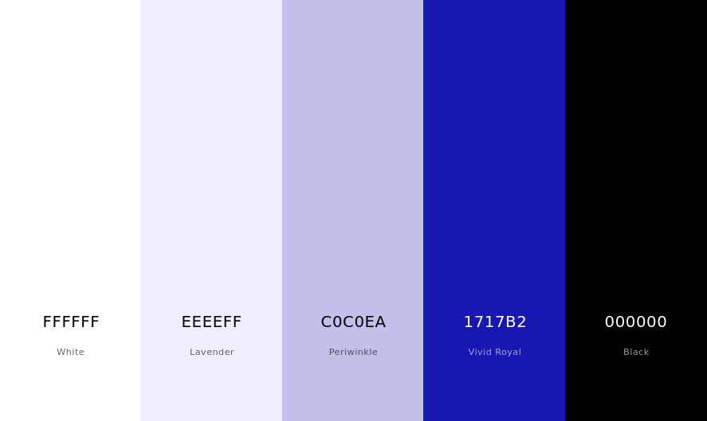

# Prevent

A student project to create a single page website introducing the British Government's Prevent programme.

[See the website here](https://ctr-code.github.io/prevent/).

## Design Brief

### External User’s Goal

The user wants a basic introduction to the Prevent strategy, including how to recognize signs of radicalisation and how to report concerns presented in a simple, easy-to-navigate format.

### Site Owner’s Goal

The site owner’s goal is to create an informative webpage that introduces the Prevent strategy. The content should be well-organised and easy to digest, with a focus on simplicity and clarity through the use of HTML and CSS with Bootstrap.

### Potential Features

* Introduction Section: A Bootstrap Jumbotron or header that briefly explains the Prevent strategy and its importance, with a background colour or image that conveys safety and community.
* Information Grid: Use Bootstrap’s grid system to create a well-organised layout for sections like “What is Prevent?” “Recognizing Risks” and “Reporting Concerns.”
* Lists of Signs: Present the signs of radicalisation using Bootstrap’s list group or bullet points to make the information easy to read.
* Action Buttons: Use Bootstrap’s button classes to create clear call-to-action buttons for reporting concerns or accessing additional resources.

## Design & Planning

### User Stories and Acceptance Criteria

1. **As a visitor, I want a clear introduction to the Prevent strategy so I can quickly understand its purpose.**
   - The page includes a short introductory section near the top.
   - The introduction explains Prevent in plain language.
   - It states the overall aim of Prevent clearly and positively.

2. **As a visitor, I want information about radicalisation so I can understand what to look out for.**
   - The page includes a dedicated section about radicalisation.
   - The section explains what radicalisation means and why it matters.
   - The content is framed in a way that is easy to understand and not alarmist.

3. **As a visitor, I want warning signs presented in a simple, readable format so I can scan them easily.**
   - Warning signs are listed in bullet points, list groups, or similar.
   - The language is concise and straightforward.
   - Related signs are grouped logically (e.g. susceptibility, behavior, process).

4. **As a visitor, I want clear guidance on how to report concerns so I know what action to take if needed.**
   - The page includes a reporting section with step-by-step guidance.
   - It tells visitors what to do first, who to contact, and what information is helpful.
   - The advice is calm, practical, and encourages acting early.

5. **As a visitor, I want the page to feel calm, clear, and welcoming so I can engage with the content comfortably.**
   - The wording is reassuring and non-judgmental.
   - The layout avoids clutter and uses whitespace for readability.
   - The visual tone supports a calm, welcoming experience.

6. **As a visitor, I want to contact the site so I can leave feedback and ask questions.**
   - A contact option or section is clearly visible.
   - It explains how visitors can leave feedback or ask questions.
   - Contact information is easy to find and access.

7. **As a site owner, I want the content to be organised into clear sections so the page is easy to navigate and understand.**
   - The page is broken into distinct sections with clear headings.
   - Each section covers one main idea or action.
   - The structure is logical and easy to scan.

8. **As a site owner, I want the design to use simple Bootstrap styling so the webpage is informative, accessible, and visually clear.**
   - Bootstrap classes are used for layout and typography.
   - The page remains responsive on mobile and desktop.
   - The styling supports accessibility and a clean visual hierarchy.

### Wireframes

As the design evolved I realised I needed a section on contacting the authorities, which is missing from the wireframes.

Mobile/Tablet | Desktop | Confirmation Popup
-- | -- | --
 |  | 

### Typography

For headers I have used the Rubik font, with the main header in bold.  It is an authoritative sans-serif font.

### Colour Scheme

I chose a simple blue palette to reflect the water theme of the hero image.

## Features:
Explain your features on the website,(navigation, pages, links, forms.....)
### Navigation
### Footer
### Other features
## Copilot AI Assistance

Copilot came up with:

* The hero image of hands.  This required a lot of work (and several day's worth of free tokens!) to get something natural looking.
* The user stories and acceptance criteria.  I edited them down.
* The idea to use a shield for the logo.  Copilot provided some examples from around the web.  I asked it to render the shield emoji from the Google Noto font as an svg but it did a poor job, so I asked it for advice on a better conversion tool.  The online tools weren't happy with emoji fonts so I searched for a pre-converted svg and hand-edited it to match the site's palette.
* Code for the Radicalisation section.  The code worked but Copilot added a bunch of gratuitous styles, which I cleaned up.

My takeaway is that Copilot is good at coming up with a bunch of ideas, but if you have something in mind it is hard to get exactly what you want.

## Technologies Used
List of technologies used for your project...
HTML
CSS
Bootstrap
Github
## Testing
Important part of your README!!!
### Google's Lighthouse Performance
Screenshots of certain pages and scores (mobile and desktop)
### Browser Compatibility
Check compatability with different browsers
### Responsiveness
Screenshots of the responsivness, pick few devices (from 320px top 1200px)
### Code Validation
Validate your code HTML, CSS (all pages/files need to be validated!!!), display screenshots
### Manual Testing user stories or/and features
Test all your user stories, you an create table 
User Story |  Test | Pass
--- | --- | :---:
paste here you user story | what is visible to the user and what action they should perform | &check;
- and attach screenshot

## Bugs

* The hero image displayed repeatedly across the screen after I added the background gradient.  I read the [MDN page on using multiple backgrounds](https://developer.mozilla.org/en-US/docs/Web/CSS/Guides/Backgrounds_and_borders/Using_multiple_backgrounds) to understand that I needed to double-up the background image properties.
* Copilot wrote the code to display the confirmation modal but it attached it to the wrong event so it didn't work.  I read the [MDN page on form submission using javascript](https://developer.mozilla.org/en-US/docs/Learn_web_development/Extensions/Forms/Sending_forms_through_JavaScript) and fixed the problem.
* Following the advice in the project statement I used a Jumbotron for the header without realising it was a Bootstrap 4 feature and didn't do anything.  Unfortunately, the boilerplate that came with it introduced an unwanted margin but when I noticed that I fixed it and removed the Jumbotron cruft.
* After clicking on an internal link the heading was hidden under the navbar.  I added `scroll-margin-top` using the browser dev tools and it fixed the problem, but when I added it to the project it didn't.  After reading this [Stack Overflow question and answer](https://stackoverflow.com/questions/72581132/how-does-the-css-property-scroll-margin-top-and-scroll-padding-top-really-wo) I realised that I had initially tested it with javascript disabled, but it didn't work in production because the navbar collapser handles the scrolling.  Using the Firefox javascript debugger I found a bug in the code to obtain the height of the navbar, and fixed it, which fixed the scrolling.
* The default bootstrap link colour had contrast problems against the light section background so I used the darker blue matching the shield border.

## Deployment

#### Creating Repository on GitHub
- First make sure you are signed into [Github](https://github.com/) and go to the code institutes template, which can be found [here](https://github.com/Code-Institute-Org/gitpod-full-template).
- Then click on **use this template** and select **Create a new repository** from the drop-down. Enter the name for the repository and click **Create repository from template**.
- Once the repository was created, I clicked the green **gitpod** button to create a workspace in gitpod so that I could write the code for the site.
#### Deloying on Github
The site was deployed to Github Pages using the following method:
- Go to the Github repository.
- Navigate to the 'settings' tab.
- Using the 'select branch' dropdown menu, choose 'main'.
- Click 'save'.

## Credit and Thanks

* [Code Institute](https://codeinstitute.net/) and its tutors for teaching, support and the navbar collapser
* [West Midlands Combined Authority](https://www.wmca.org.uk/) for funding
* [Tim Berners-Lee](https://www.w3.org/People/Berners-Lee/) *et al* for the web
* [GitHub](https://github.com/) for hosting the repository, the project plan and the site
* [Bootstrap](https://getbootstrap.com/) for the CSS framework
* [Font Awesome](https://fontawesome.com/) for icons
* [Fort Awesome](https://github.com/FortAwesome/Font-Awesome/releases) for collating the Font Awesome assets
* [Bunny CDN](https://fonts.bunny.net/) for font hosting
* [The Rubik authors](https://github.com/googlefonts/rubik) for the Rubik font
* [Microsoft](https://www.microsoft.com/) for [Visual Studio Code](https://code.visualstudio.com/)
* [Copilot](https://copilot.microsoft.com/) for illustrations, brainstorming and copy
* [Google](https://github.com/googlefonts/noto-emoji) for the Noto Emoji font, which provided the basis for the shield logo
* [Action Counters Terrorism](https://actearly.uk/) for Prevent guidance
* [His Majesty's Government](https://www.gov.uk/government/publications/prevent-duty-guidance/prevent-duty-guidance-for-england-and-wales-accessible#prevents-objectives) for the Prevent objectives
* [Balsamiq](https://balsamiq.com/) for trying to upsell me export after I'd completed the wireframes
